<p align="center">
  
</p>

<h1 align="center">MikLink</h1>

<p align="center">
  <strong>A guerrilla cable testing tool for the rest of us.</strong><br>
  <em>Because Fluke costs more than my car.</em>
</p>

<p align="center">
  
  
  
  
  
</p>

---

## 📸 Screenshots

<table>
  <tr>
    <td align="center">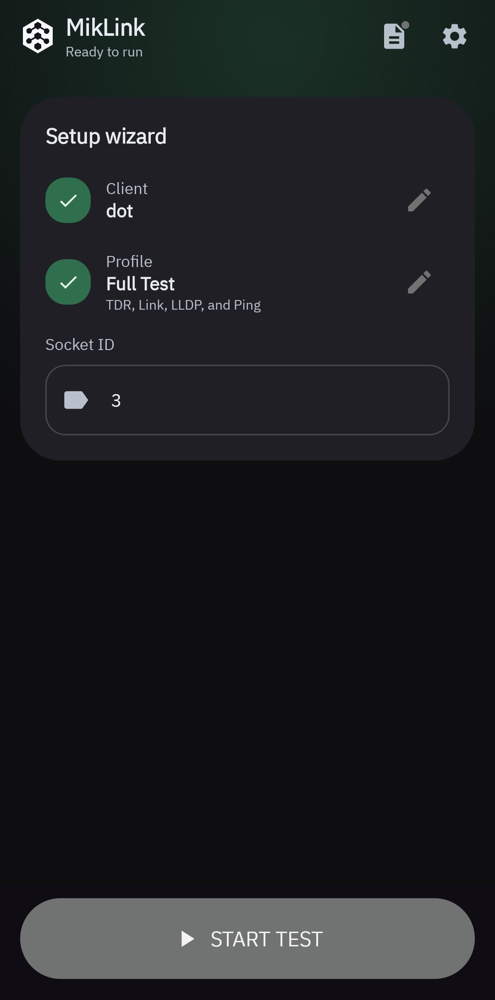<br><sub><b>Dashboard</b><br>Your testing hub</sub></td>
    <td align="center">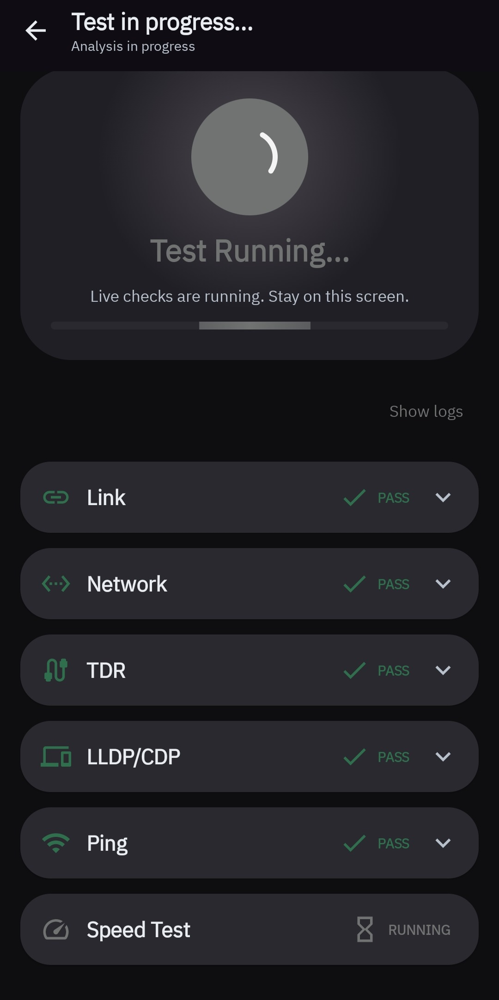<br><sub><b>Running Test</b><br>Real-time progress</sub></td>
    <td align="center">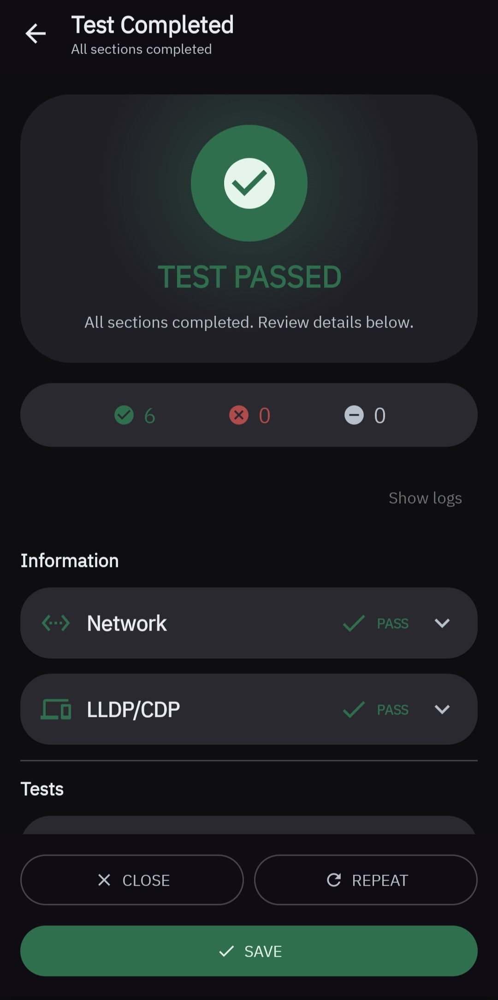<br><sub><b>Test Completed</b><br>Results at a glance</sub></td>
  </tr>
  <tr>
    <td align="center">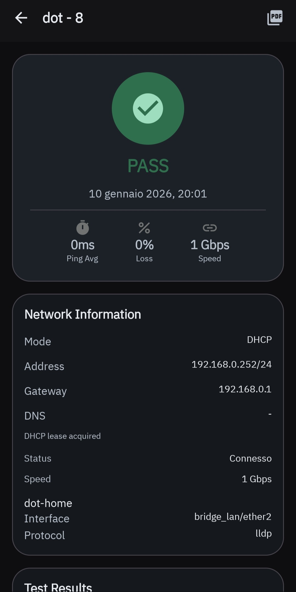<br><sub><b>Test Detail</b><br>Deep dive into results</sub></td>
    <td align="center">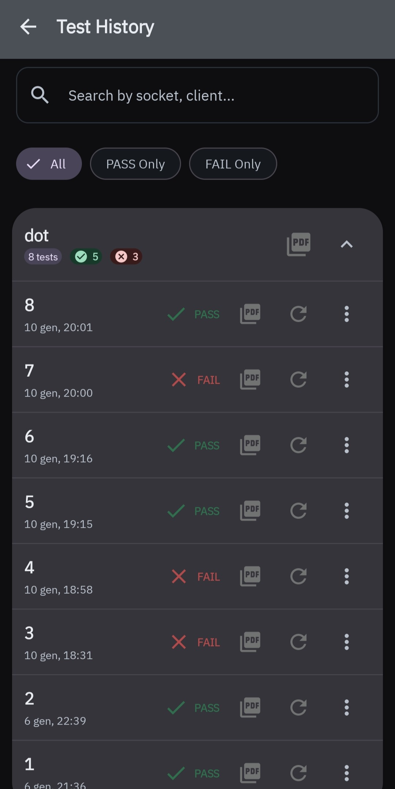<br><sub><b>Test History</b><br>All your reports</sub></td>
    <td align="center">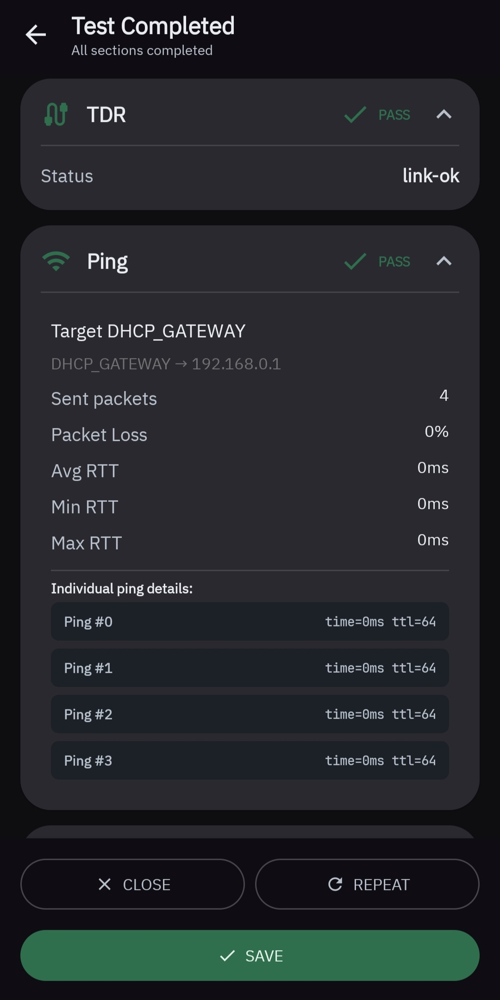<br><sub><b>Ping Detail</b><br>Latency analysis</sub></td>
  </tr>
  <tr>
    <td align="center">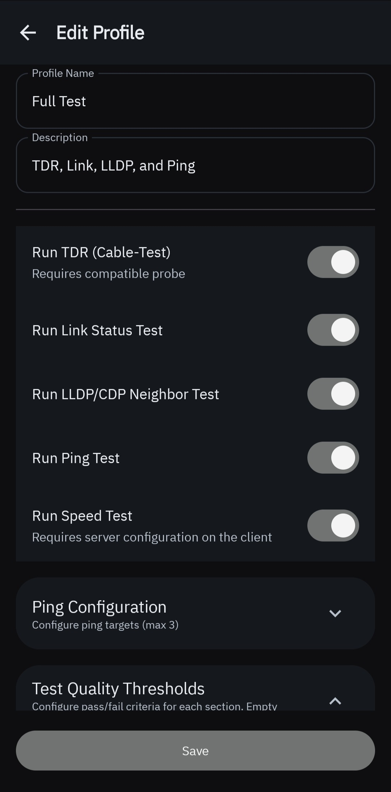<br><sub><b>Edit Profile</b><br>Customize test steps</sub></td>
    <td align="center">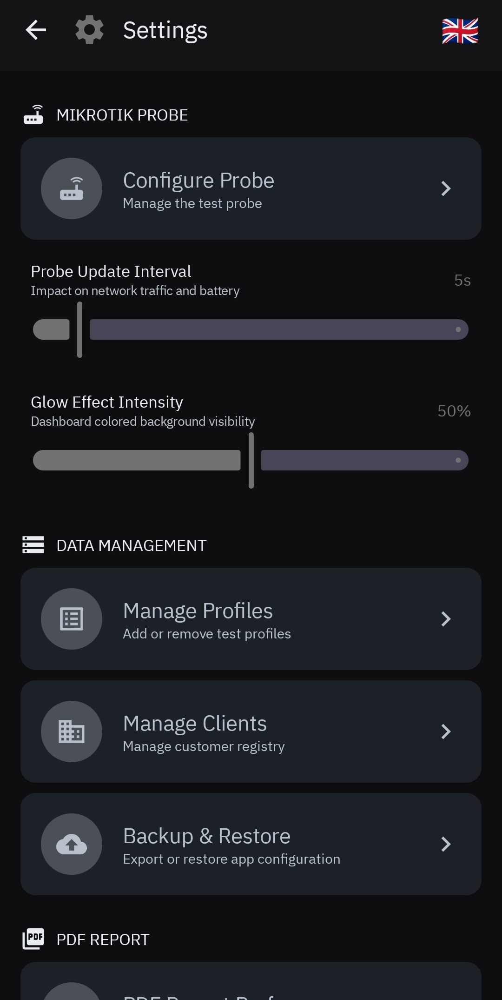<br><sub><b>Settings</b><br>App configuration</sub></td>
    <td align="center">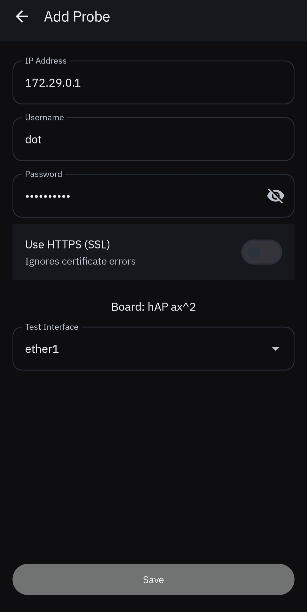<br><sub><b>Add Probe</b><br>Connect your MikroTik</sub></td>
  </tr>
</table>

---

## 🔥 What is this?

MikLink turns any **MikroTik RouterBoard** into a cable testing probe. It runs diagnostics and generates **PDF reports** you can hand to clients or slap on an electrician's desk.

Built for IT techs caught in the eternal war between _"the cable works"_ and _"10 Mbps is not working"_.

The app communicates with RouterOS 7.x via the **REST API** – no custom firmware, no SSH hacks, just clean HTTP calls.

---

## 🎯 The Problem

You're an IT professional. An electrician just finished the structured cabling. They say it's done. You plug in and get garbage speeds. They blame your switch. You blame their crimping. Nobody wins. The client is pissed.

Professional tools like **Fluke** cost **$2,000+**. That's insane for small MSPs or one-off projects.

---

## 💡 The Solution

Use a **€100 MikroTik RouterBoard** as your probe. MikLink does the rest.

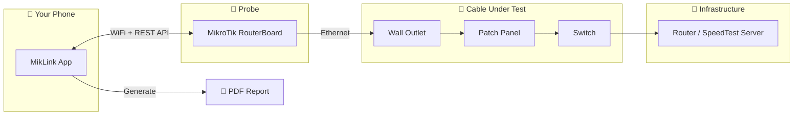

---

## ⚡ Features

| Feature | What it does |
|---------|--------------|
| 🔗 **Link Status** | Verifies physical connection and negotiated speed. Detects if you're stuck at 10/100 when you should be at gigabit. |
| 🧪 **Cable Test (TDR)** | Time-Domain Reflectometry on supported models. Finds opens, shorts, and cable length issues. |
| 📊 **Speed Test** | Throughput test to verify end-to-end performance. Stress the cable, prove it works (or doesn't). |
| 🔍 **Neighbor Discovery** | LLDP/MNDP/CDP detection. See what's connected on the other end. |
| 🏓 **Ping Test** | Customizable ping tests to multiple targets. Verify routing and latency. |
| 📑 **PDF Reports** | Professional-looking reports with all test results. No more arguing. |

### 📄 PDF Report Options

<p align="center">
  <a href="screenshot/report_example.pdf">📥 Download Example Report</a>
</p>

The PDF generator is highly customizable:

- **Orientation**: Portrait or landscape layout
- **Column selection**: Choose which data columns to include
- **Hide empty columns**: Keep reports clean and relevant
- **Signature fields**: Optional spaces for tester and cabling technician signatures
- **Include/exclude empty tests**: Filter out skipped or incomplete tests

---

## 🛠️ The Setup

<p align="center">
  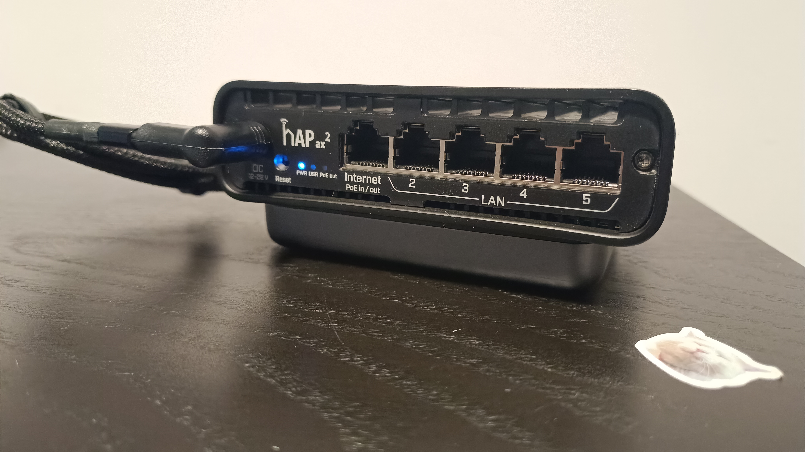
</p>

My go-to setup is a **MikroTik hAP ax2** powered by a **UGreen 10000mAh powerbank** with a USB-C to barrel jack adapter that tricks the powerbank into delivering 12V @ ~1.5A. Fits in a bag, lasts for hours.

**Total cost: ~€130** for a portable cable tester. Fluke who?

---

## 📋 Requirements

| Requirement | Value |
|-------------|-------|
| **Android** | 11+ (API 30) – works great on older phones/tablets |
| **MikroTik RouterOS** | 7.x with REST API enabled |
| **Access Level** | Admin credentials to the RouterBoard |

---

## 🚀 Quick Start

1. **Download** the APK from Releases
2. **Configure probe**: Enter MikroTik IP, username, password
3. **Create client**: Company name, network settings, socket ID format
4. **Create test profile**: Choose which tests to run
5. **Connect** the cable you want to test
6. **Run test** and wait for results
7. **Export PDF** and close the discussion

---

## ⚙️ MikroTik Configuration

The MikroTik needs minimal setup. Here's what you need:

1. **Create a bridge** for the WiFi interfaces
2. **Set up WiFi as AP** so your phone can connect
3. **Configure a DHCP server** on the wireless side
4. **Enable REST API** (`/ip service set www-ssl disabled=no`)

The app handles DHCP client or static IP configuration on the test port automatically.

<details>
<summary><strong>📝 Example Configuration (hAP ax2)</strong></summary>

```routeros
/interface bridge add name=bridge1
/interface ethernet switch set 0 cpu-flow-control=yes

/interface wifi configuration add channel.band=5ghz-ax .skip-dfs-channels=all \
    .width=20/40mhz-Ce country=Italy disabled=no hide-ssid=no \
    installation=indoor mode=station-bridge name=cfg1 \
    security.authentication-types=wpa2-psk,wpa3-psk \
    .encryption=ccmp,gcmp,ccmp-256,gcmp-256 .passphrase=YourPassword ssid=Miklink

/interface wifi set [ find default-name=wifi1 ] configuration=cfg1 \
    configuration.mode=ap disabled=no
/interface wifi set [ find default-name=wifi2 ] channel.band=2ghz-ax \
    configuration=cfg1 configuration.mode=ap disabled=no

/ip pool add name=dhcp_pool0 ranges=172.29.0.2-172.29.0.254
/ip dhcp-server add address-pool=dhcp_pool0 interface=bridge1 name=dhcp1

/interface bridge port add bridge=bridge1 interface=wifi1
/interface bridge port add bridge=bridge1 interface=wifi2

/ip address add address=172.29.0.1/24 interface=bridge1 network=172.29.0.0
/ip dhcp-server network add address=172.29.0.0/24 dns-none=yes gateway=172.29.0.1

# Enable REST API
/ip service set www-ssl disabled=no
```

</details>

---

## 📊 Speed Test Server

If your client's main router is also a MikroTik, you can enable the built-in **Bandwidth Test Server**:

```routeros
/tool bandwidth-server set enabled=yes authenticate=no
```

Configure MikLink to point to that server IP. The speed test will stress the entire cable run from your probe to the core switch. Ultimate proof of performance.

---

## ⚠️ Known Issues & Limitations

Let's be real – this is beta software built with vibe coding. Here's what you should know:

| Issue | Status | Notes |
|-------|--------|-------|
| **Incomplete translations** | 🟡 WIP | Italian/English mix. PRs welcome. |
| **Rapid sequential tests** | 🟠 Bug | Starting tests too quickly can cause issues. Take a breath between tests. |
| **HTTP communication** | 🟢 By design | Yes, it's HTTP(S) between your phone and the MikroTik. They're on the same WiFi. If someone's MITMing your probe's WiFi, you have bigger problems. |
| **TDR implementation** | 🟡 Partial | The cable test doesn't strictly follow MikroTik's docs. It works, but don't bet your career on it. For real certifications, buy a Fluke. |

---

## ⚠️ Development Disclaimer

This project was built **100% with vibe coding** (AI-assisted development).

What this means:

- It works, but it's not a textbook example of clean code
- There are probably better ways to do everything
- I prioritized _"solves the problem"_ over _"elegant architecture"_
- The code might make senior devs cry

**If you're a purist, this repo may cause physical pain.** You've been warned.

---

## 📚 Documentation

- **[Technical Architecture](docs/reference/technical-architecture.md)** – For the nerds who want to understand (or judge) the code
- **[Database Schema](docs/reference/database.md)** – Room database structure
- **[Build Instructions](docs/reference/build.md)** – How to compile this mess
- **[ADRs](docs/decisions/)** – Why things are the way they are

---

## 🤝 Contributing

The code is here. Do whatever you want with it.

PRs welcome, but I can't promise fast reviews. If you find a critical bug, open an issue. If you want to refactor everything because the code offends you—go ahead, you're probably right.

---

## ⚖️ Disclaimer

This tool is provided **AS-IS** with no warranties.

I'm not responsible if:

- The report says a cable is good when it's garbage
- The report says a cable is garbage when it's fine
- An electrician gets offended by the report
- Your client uses the PDF as evidence in court
- Anything, really

**For official certifications, buy a Fluke.**

---

## 📄 License

MIT – Do whatever you want, you owe me nothing.

---

## 🏴 Featured By

<p align="center">
  <br>
  <strong>shitworks</strong><br>
  <em>'cause shit always works</em>
</p>

---

<p align="center">
  <em>Built with 🤖 vibe coding and 😤 frustration at bad cabling.</em>
</p>
