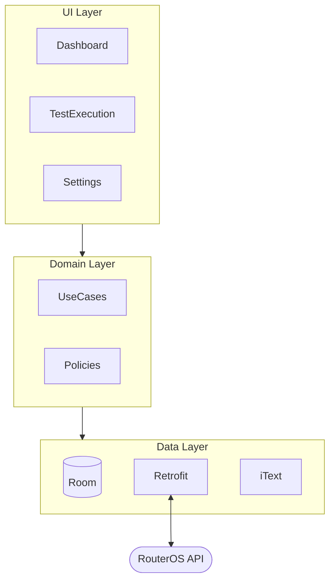
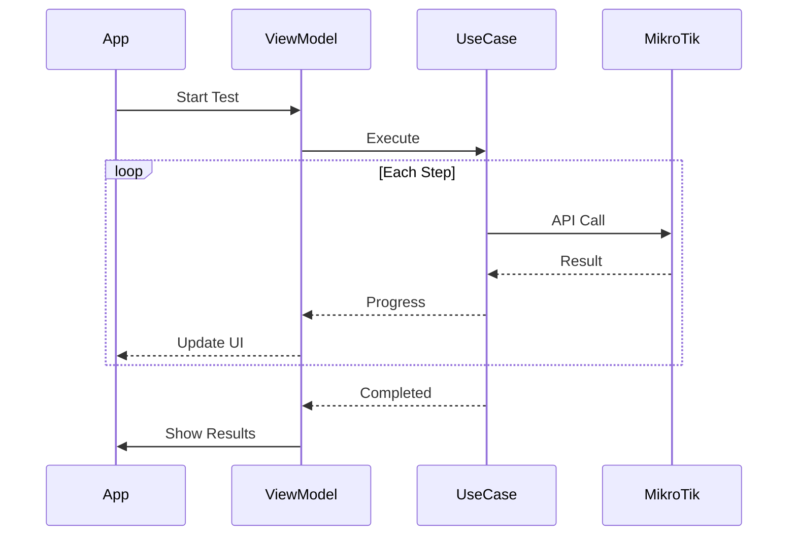

<p align="center">
  
</p>

<h1 align="center">MikLink</h1>

<p align="center">
  <strong>A guerrilla cable testing tool for the rest of us.</strong><br>
  <em>Because Fluke costs more than my car.</em>
</p>

<p align="center">
  
  
  
  
</p>

---

## 🔥 What is this?

MikLink turns any **MikroTik RouterBoard** into a cable testing probe. It runs diagnostics and generates **PDF reports** you can hand to clients or slap on an electrician's desk.

Built for IT techs caught in the eternal war between _"the cable works"_ and _"10 Mbps is not working"_.

---

## 🎯 The Problem

You're an IT professional. An electrician just finished the structured cabling. They say it's done. You plug in and get garbage speeds. They blame your switch. You blame their crimping. Nobody wins. The client is pissed.

Professional tools like **Fluke** cost **$2,000+**. That's insane for small MSPs or one-off projects.

---

## 💡 The Solution

Use a **€50 MikroTik RouterBoard** as your probe. MikLink does the rest.


---

## ⚡ Features

### 🔗 Link Status Check

Verifies physical connection and negotiated speed. Detects if you're stuck at 10/100 when you should be at gigabit.

### 🧪 Cable Test (TDR)

Time-Domain Reflectometry on supported models. Finds opens, shorts, and cable length issues. Not as precise as Fluke, but it's **free**.

### 📊 Speed Test

Internal throughput test to verify end-to-end performance. The ultimate proof that the cable either works or doesn't.

### 🔍 Neighbor Discovery

LLDP/MNDP/CDP detection. See what's connected on the other end.

### 🏓 Ping Test

Customizable ping tests to multiple targets. Verify routing and latency.

### 📑 PDF Reports

Professional-looking reports with all test results. Attach to acceptance documents. No more arguing.

---

## 🏗️ Architecture



### Test Execution Flow



---

## 🧪 Test Steps

| Step               | Description                          | Requires          |
| ------------------ | ------------------------------------ | ----------------- |
| **Link Status**    | Physical link state, speed, duplex   | Any interface     |
| **Cable Test**     | TDR reflectometry analysis           | Supported models¹ |
| **Network Config** | DHCP lease or static IP verification | Configured client |
| **Ping**           | ICMP tests to custom targets         | Target IP(s)      |
| **Speed Test**     | Bandwidth test to internal server    | Speed test server |
| **Neighbors**      | LLDP/MNDP/CDP discovery              | Protocol enabled  |

> ¹ TDR support varies by model. CCR, RB4011, RB3011, hEX, hAP series generally supported. Check MikroTik docs.

---

## ⚠️ Development Disclaimer

This project was built **100% with vibe coding** (AI-assisted development).

What this means:

- It works, but it's not a textbook example of clean code
- There are probably better ways to do everything
- I prioritized _"solves the problem"_ over _"elegant architecture"_
- The code might make senior devs cry

**If you're a purist, this repo may cause physical pain.** You've been warned.

---

## 📋 Requirements

| Requirement       | Version                          |
| ----------------- | -------------------------------- |
| Android           | 11+ (API 30)                     |
| MikroTik RouterOS | 7.x with REST API enabled        |
| Access Level      | Admin credentials to RouterBoard |

---

## 🚀 Quick Start

1. **Download** the APK from Releases
2. **Configure probe**: Enter MikroTik IP, username, password
3. **Create client**: Company name, network settings, socket ID format
4. **Create test profile**: Choose which tests to run
5. **Connect** the cable you want to test
6. **Run test** and wait for results
7. **Export PDF** and close the discussion

---

## 📁 Project Structure

```
com.app.miklink
├── core/
│   ├── domain/          # Pure Kotlin business logic
│   │   ├── model/       # Client, ProbeConfig, TestReport...
│   │   ├── policy/      # SocketIdLite, TestQualityPolicy
│   │   ├── test/        # Test steps, events, snapshots
│   │   └── usecase/     # SaveTestReport, RunTest...
│   └── data/            # Repository interfaces (ports)
├── data/                # Implementations
│   ├── local/           # Room database
│   ├── remote/          # MikroTik API client
│   ├── pdf/             # iText PDF generator
│   └── repository/      # Repository implementations
├── ui/                  # Jetpack Compose UI
│   ├── dashboard/       # Main screen
│   ├── test/            # Test execution
│   ├── history/         # Reports browser
│   └── settings/        # Configuration
└── di/                  # Hilt dependency injection
```

---

## 🤝 Contributing

The code is here. Do whatever you want with it.

PRs welcome, but I can't promise fast reviews. If you find a critical bug, open an issue. If you want to refactor everything because the code offends you—go ahead, you're probably right.

### Documentation

Technical docs are in `/docs`:

- `explanation/` – Architecture and feature descriptions
- `reference/` – Technical reference (API, DB, build)
- `decisions/` – ADRs for non-obvious choices

---

## ⚖️ Disclaimer

This tool is provided **AS-IS** with no warranties.

I'm not responsible if:

- The report says a cable is good when it's garbage
- The report says a cable is garbage when it's fine
- Someone gets offended by the report
- Any other thing

For official certifications, buy a Fluke.

---

## 📄 License

MIT – Do whatever you want, you owe me nothing.

---

<p align="center">
  <em>Built with 🤖 vibe coding, ☕ caffeine, and 😤 frustration at bad cabling.</em>
</p>
