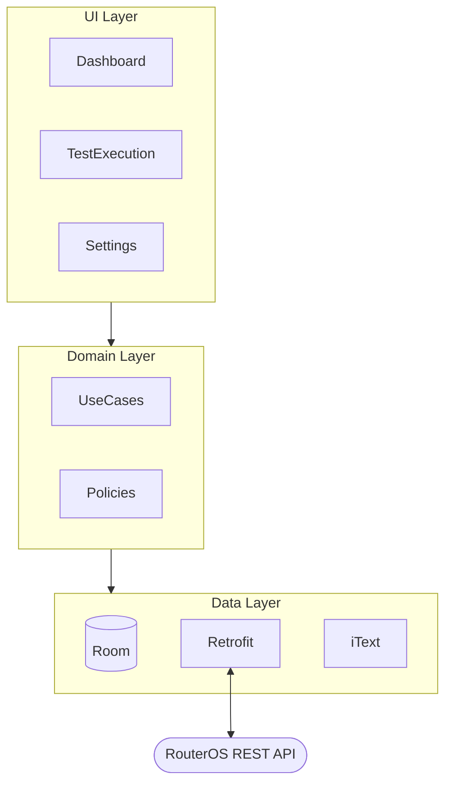
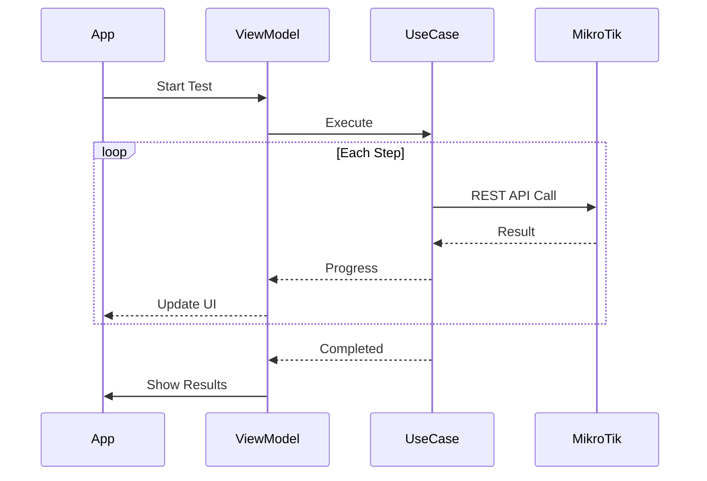

# MikLink – Technical Architecture

> **For nerds only.** If you just want to test cables, go back to the [main README](../../README.md).

---

## 🏗️ Architecture Overview

MikLink follows a Clean Architecture approach with three main layers:



### Test Execution Flow



---

## 📁 Project Structure

```
com.app.miklink
├── core/
│   ├── domain/          # Pure Kotlin business logic
│   │   ├── model/       # Client, ProbeConfig, TestReport...
│   │   ├── policy/      # SocketIdLite, TestQualityPolicy
│   │   ├── test/        # Test steps, events, snapshots
│   │   └── usecase/     # SaveTestReport, RunTest...
│   └── data/            # Repository interfaces (ports)
├── data/                # Implementations
│   ├── local/           # Room database
│   ├── remote/          # MikroTik REST API client
│   ├── pdf/             # iText PDF generator
│   └── repository/      # Repository implementations
├── ui/                  # Jetpack Compose UI
│   ├── dashboard/       # Main screen
│   ├── test/            # Test execution
│   ├── history/         # Reports browser
│   └── settings/        # Configuration
└── di/                  # Hilt dependency injection
```

---

## 🔌 MikroTik REST API

MikLink communicates with RouterOS 7.x using the **REST API** introduced in RouterOS 7.1beta4.

### Enabling REST API

On your MikroTik, enable the REST API service:

```
/ip service set www-ssl disabled=no
```

The app uses standard HTTP/HTTPS requests to interact with the router. Authentication is handled via HTTP Basic Auth.

### API Endpoints Used

| Endpoint | Purpose |
|----------|---------|
| `/rest/interface` | Get interface status, link speed, duplex |
| `/rest/interface/ethernet/cable-test` | TDR cable diagnostics |
| `/rest/ip/neighbor` | LLDP/MNDP/CDP discovery |
| `/rest/ping` | ICMP ping tests |
| `/rest/tool/speed-test` | Bandwidth testing |
| `/rest/ip/dhcp-client` | Configure DHCP on interfaces |
| `/rest/ip/address` | Static IP configuration |

---

## 🧪 Test Steps Details

| Step | Description | Requirements |
|------|-------------|--------------|
| **Link Status** | Physical link state, negotiated speed, duplex mode | Any Ethernet interface |
| **Cable Test** | TDR reflectometry analysis | Supported models¹ |
| **Network Config** | DHCP lease or static IP verification | Configured client |
| **Ping** | ICMP tests to custom targets | Target IP(s) |
| **Speed Test** | Bandwidth test to configured server | Speed test server |
| **Neighbors** | LLDP/MNDP/CDP discovery | Protocol enabled |

> ¹ TDR support varies by model. CCR, RB4011, RB3011, hEX, hAP series generally supported. Check [MikroTik docs](https://help.mikrotik.com/docs/display/ROS/Ethernet).

---

## 💾 Data Persistence

MikLink uses **Room Database** for local storage:

- **Probes**: Saved MikroTik configurations
- **Clients**: Company/site information
- **Test Profiles**: Saved test configurations
- **Test Reports**: Historical test results

---

## 📄 PDF Generation

Reports are generated using **iText** library. The PDF includes:

- Client/site information
- Test date and probe details
- All test results with pass/fail indicators
- Cable test details (if available)
- Speed test graphs (if performed)

---

## 🔧 Build Configuration

| Setting | Value |
|---------|-------|
| Min SDK | 30 (Android 11) |
| Target SDK | 36 |
| Compile SDK | 36 |
| Kotlin | JVM 17 |
| Dependency Injection | Hilt |
| Annotation Processing | KSP |
| UI | Jetpack Compose |

---

## 📚 Further Reading

- [Database Schema](database.md)
- [Build Instructions](build.md)
- [Testing Guide](testing.md)
- [UI Architecture](ui-architecture.md)
- [Project Structure](project-structure.md)

---

## 🏛️ Architecture Decision Records

Non-obvious design choices are documented as ADRs in `/docs/decisions/`:

- [ADR-0001: Single Probe](../decisions/ADR-0001-single-probe.md)
- [ADR-0002: HTTPS Toggle Trust All](../decisions/ADR-0002-https-toggle-trust-all.md)
- [ADR-0003: DB Rebase Baseline](../decisions/ADR-0003-db-rebase-baseline.md)
- [ADR-0004: Socket ID Lite](../decisions/ADR-0004-socket-id-lite.md)
- And more...
